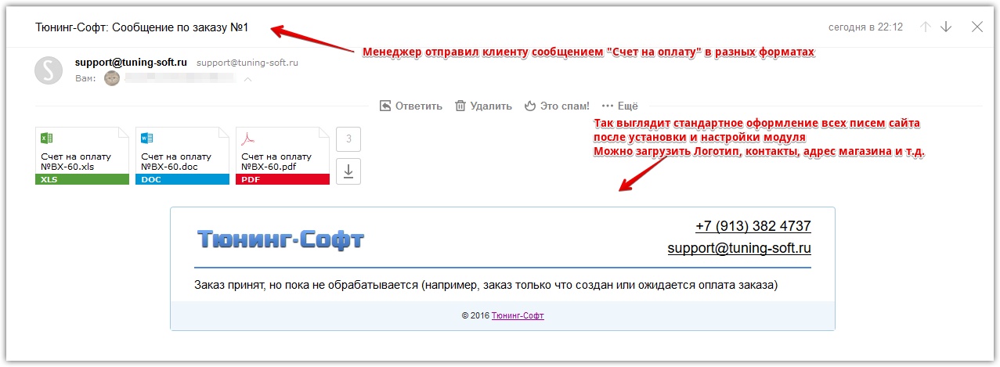
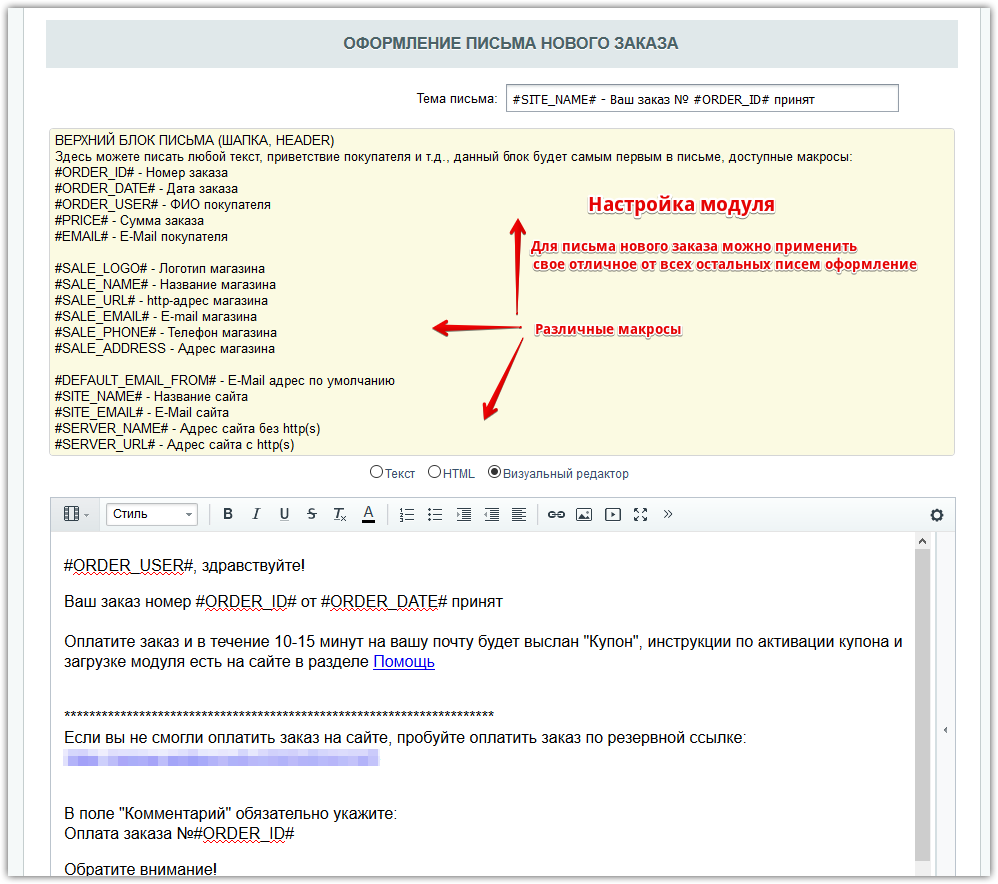

# api.orderstatus

## TS Умные статусы и письма заказов (api.orderstatus)
   TS Умные статусы и письма заказов битрикс – это расширенные возможности управления заказом и всеми письмами сайта, запись истории отправленных статусов по e-mail и sms, отправка e-mail и sms-сообщений покупателю прямо из заказа, прикрепить счет или файл к заказу или статусу, блочное оформление письма нового заказа и вообще всех писем сайта, дополнительные макросы для всех писем сайта, дополнительные шаблоны e-mail и sms-статусов заказа, встроены SMS-шлюзы для России и Украины.
   

